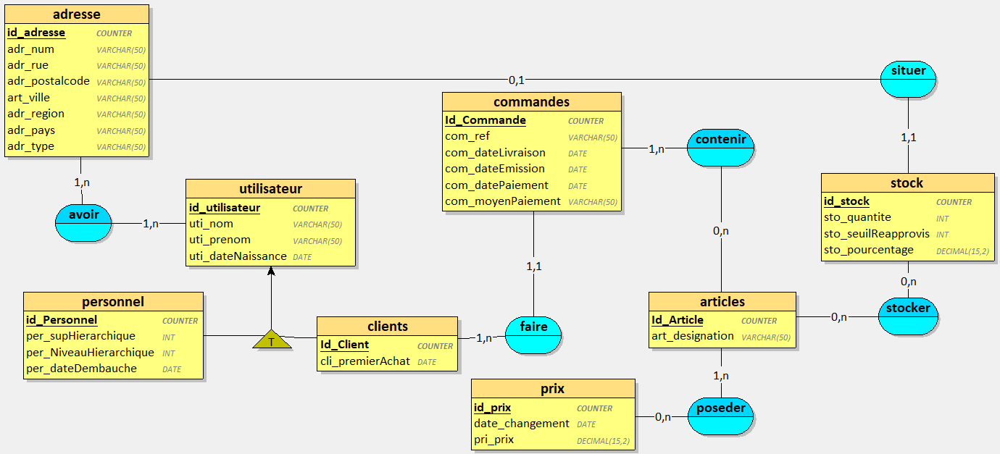
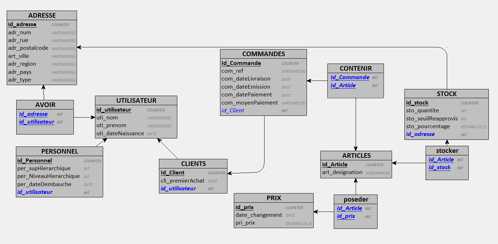

# 
 MININF-PROJET-POO 

## objectif de realiation : 

definition et creation de la base de donne : 
    mcd 
    mld
    Dictionnaires des données

definition de action pour interagir avec la base de donne 
    diagramme uml : séquence (cree, modifier, supprimer, afficher des donne)
    diagramme uml : activité
    diagramme uml : classe 

## directive fournie : 

## definition et creation de la base de donne : 

### mcd 

### mld

### Dictionnaires des données

[voir excel (POO dictionnaire de données)](POO_dictionnaire_de_données.xlsx)

### ecriture de code permetent la creation de la base de donne (mpd)

[voir bdd.sql](bdd.sql)
