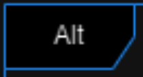
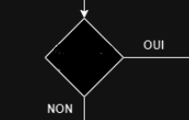

# 
 MININF-PROJET-POO 

## membre
Toubeau Mathis
Lepetit Augustin
Le Nozahic Corentin
Carlot Willy
## objectif de réalisation : 

définition et création de la base de données : 

    Dictionnaires des données
    mcd 
    mld

définition des interagir avec la base de données et de la modelisation 
    diagramme uml : séquence (créer, modifier, supprimer, afficher des données)
    diagramme uml : activité
    diagramme uml : classe 

## définition et création de la base de données : 

### Dictionnaires des données 

[ditionaire de donne et table de liasion](POO_dictionnaire_de_données.xlsx)

Afin de clarifier la situation pour notre équipe, nous avons réalisé un dictionnaire de données qui répertorie pour chaque variable, un type, une taille, un commentaire et une table associée.

Ensuite nous avons réalisé la table de liaison du dictionnaire de données précédent afin de renseigner les différentes associations entre les différentes tables.

/ : indique qu’il ne peut pas y avoir d’association car cela correspondrait à une association avec elle même
1 : indique que la variable est contenue dans la table dont fait partie la clée primaire
(1): indique qu’il existe une association qui lie les deux tables impliquées
### mcd / mld

Pour la modélisation de nos MCD/MLD, nous avons choisi de créer 9 tables : 
utilisateur
personnel
clients
commandes
articles
adresse 
ville 
région 
pays
Nous avons utilisé un héritage pour les tables  : 
personnel 
client  
Car ces 2 classes ont en commun les attributs nom, prénom et date de naissance. Ainsi nous évitons les répétitions dans notre base de données.
Nous avons également décomposé l’adresse

### écriture du code permettant la création de la base de données (mpd)

[voir bdd.sql](bdd.sql)

## modélisation de l’application

### Diagramme de classes

Notre diagramme de classe contient le **mapping** de notre base de données **(visible sur la partie gauche du diagramme)** avec les classes articles, commandes et utilisateur.
Toutes ces classes filles héritent des méthodes select, insert, delete et update issu de la classe mère CLmap. Elles auront chacune un résultat différent selon la classe dans laquelle ces méthodes sont utilisées grâces au polymorphisme. 

De même pour les **classes filles (visible sur la partie droite du diagramme)** : 
- CLservice_clients
- CLservice_commandes
- CLservice_stock
- CLservice_statistiques
- CLservice_personnel

Toutes ces classes héritent de la classe mère service. Cela permet d’éviter les répétitions pour les méthodes (afficher / ajouter / supprimer / modifier) qui seront utilisées dans toutes les classes filles.
Pour finir les classes CLcad, CLmap et service son associé, cela signifie qu'elles interagissent entre elles.

### Diagramme de cas d’utilisation :
Le diagramme de cas d’utilisation va nous permettre de : 
- Définir les exigences du systèmes
- Visualiser les fonctionnalités du système 
- Synthétiser le système 
- Identifier les acteurs et leurs rôles 

Nous avons défini un acteur principal : 
- le Personnel
Nous avons défini des acteur secondaires : 
- Base de données
- Supérieur hiérarchique
Ce diagramme explique le plus simplement possible de manière visuelle l fonctionnement de notre système : 
- la gestion de la base de données pour une entreprise de vente en ligne de composants électroniques.
Ce diagramme permet de mettre en avant les fonctionnalités premières de notre application sans entrer dans les détails. Ainsi nous avons synthétisé notre projet de la façon la plus simple.

### Diagramme de séquences :
Le diagramme de séquence va nous permettre de représenter l'interaction entre les objets dans notre système lors d'une séquence d'opérations.
Cette séquence d’opérations permet de réaliser une tâche précise, ici nous allons voir les diagrammes pour permettre : 
- l’affichage d’un personnel
- la création d’un personnel 
- la modification d’un personnel
- suppression d’un personnel
Puisque les diagrammes ont été créé avec la même base, nous expliquerons un seul diagramme, par exemple : 
- le diagramme de la création d’un personnel

#### Légende Générale Diagramme Séquence: 

Acteurs (Utilisateur, Ihm, Système, Base de données) : Ils représentent les entités qui interagissent avec le système. L'utilisateur déclenche les actions, l'interface homme-machine (IHM) est le moyen par lequel l'utilisateur interagit avec le système, le système lui-même traite les demandes, et la base de données sert à stocker et récupérer les informations.

Barres de vie : Les lignes verticales continues indiquent la durée de vie d'un objet ou d'une interaction dans le système.

Messages : Les flèches horizontales représentent les messages ou les actions qui sont envoyés entre les acteurs et les objets. Par exemple, "Demande de création d'un personnel" est un message de l'utilisateur vers l'IHM.

Boîtes d'activation : Les rectangles fins qui se prolongent vers le bas des barres de vie représentent la période pendant laquelle un objet est actif ou en train de traiter une action.

Conditions et alternatives (Alt) : Les blocs "Alt" sont des points de décision où le flux d'exécution peut suivre différents chemins en fonction d'une condition. Par exemple, il y a une vérification pour voir si le personnel existe déjà, avec des chemins alternatifs pour soit annuler la création soit la valider.

Flèches de retour : Les flèches en pointillés indiquent un retour de message, par exemple, après une vérification dans la base de données.

Commandes SQL : Ces messages spécifient les interactions avec la base de données, comme une commande "INSERT" pour ajouter de nouvelles données.
#### Créer un personnel

Ce diagramme de séquence nous permet de montrer les différentes étapes à suivre et celles par lesquelles le système passe pour créer un nouveau personnel. 
En effet nous pouvons y voir toutes les interactions entre les Objets du système : 
- Utilisateur
- Ihm (interface)
- Système (programme)
- Base de données

#### Modifier un personnel

#### Supprimer un personnel

#### Afficher un personnel

### Diagramme d’activité (Gestion d’un personnel)

\
Légende :
\

\
Permet de faire une condition Si et donc de faire des vérifications au sein de la table ou pour vérifier une action utilisateur. 
\

\
Permet d’identifier les actions effectuées au sein de la Table “Personnel”.
\

\
Permettent de rejoindre deux actions vers une action finale.
\

\
Permet d’identifier la fin de la branche et de mettre fin à l’action orchestrée dans la table.
\

\
Marque le début du diagramme d’activité. 

Notre diagramme d’activité va nous permettre d’illustrer nos activités au sein de la Table “Personnel” et les changements qui peuvent être opérés au sein de cette Table comme : 
Sélection 
Modification 
Suppression 
Affichage  

## Conclusion : 
En conclusion, au cours de ce livrable, nous avons fait une analyse du besoin de notre client pour modéliser l’organisation de notre application graphique ainsi que la base de données associée en passant par le fonctionnement global du système. Enfin, nous avons pu à l'aide des différents diagrammes de séquences expliquer le fonctionnement détaillé de notre application relié à notre base de données en précisant leur échange d”informations. 

