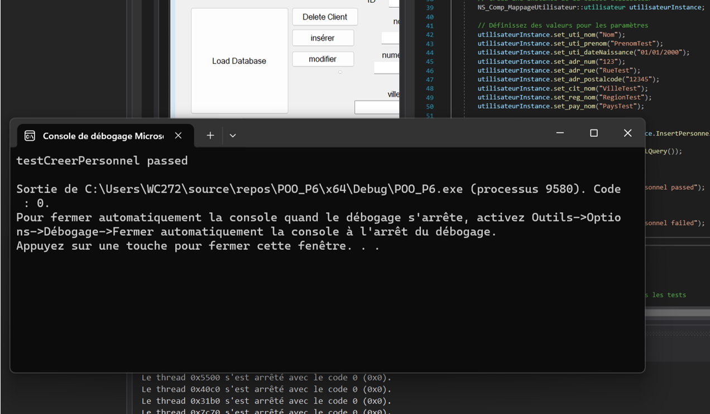
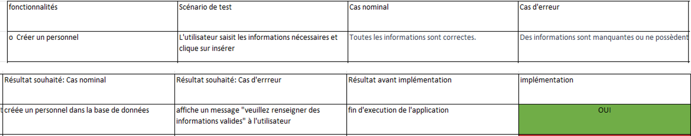

# <p align="center" > MININF-PROJET-POO </p>
# Livrable 3 :  
## Sommaire :
- Contexte  

- Spécifications fonctionnelles  

- Cahier de test  

- Spécifications techniques 

- Tests unitaires 

- Conclusion 

## CONTEXTE : 

Une nouvelle entreprise développe son système d’information. Dans le premier livrable, nous avions spécifié l’architecture de notre base de données et les prémisses de l’architecture de notre code ainsi que son fonctionnement global. Dans l’optique de continuer sur cette lancée dans ce livrable, nous allons aborder les aspects techniques et fonctionnels de notre code afin de fournir à l’utilisateur une aide d’utilisation.

## SPÉCIFICATIONS FONCTIONNELLES :  
[Cf. document – Spécification fonctionnelle Equipe 07](Specification_fonctionnelle_Equipe_07.pdf)
## SPÉCIFICATIONS TECHNIQUES : 
Lors de l’application de notre code, nous nous sommes rendu compte de quelques discordances entre les actions que nous voulions effectuer et la base de donne que nous avions créé lors du livrable 2 pour que celle-ci soit plus en corrélation avec la demande, nous avons effectué quelques modifications. 

D’abord sur la table stock où nous avons transfert la quantité d’article à la table de liaison de stock et article ce qui nous permet d’avoir plusieurs quantités d’article en fonction du stock et des articles  

Suivie du seuil de réapprovisionnement qui rencontre le même problème  

Comme précisé dans le livrable 1 nous devions créer des requêtes permettant de modifier créer supprimer et afficher un personnel l'application pratique cette demande est la création de procédures stockées qui nous permettent de rendre notre code plus lisible et de dissocier notre code de la base de données. 

Pour l’architecture, nous avons opté pour une architecture en trois couches, interface homme machine composé de l’ensemble des fichiers qui compose l’interface graphique (MyForm) service composé du fichier service s'occupent de faire la liaison entre la base de données et notre interface graphique.  

 

Cette couche contient l’ensemble des appels à fonction des requêtes du “mapping” et pour la dernière couche composante qui est composée du “mapping” avec toutes les fonctions qui récupèrent des valeurs de la base de donne ou qui préparé cette même valeur à être envoyé et la base de données  


## PROCÉDURES STOCKÉES :
\
[dossier procedure stoker](procedure)
\
Nous avons fait le choisi d’utiliser les procédure stock dans la molarité des cas. Car celle-ci nous donne les mêmes libertés qu’une requête récrit dans le code et nous permet de rendre le code plus lisible et de marquer encore plus la différence entre le composant et le service de plus le procédure stoker peuvent être modifier sans toucher au code  

Nous allons expliciter une Procédure stockée simple pour montre le fonctionnement de chacun d’elle  

```sql
CREATE PROCEDURE DeletePersonnel
    @PersonnelId INT
AS
BEGIN
    -- Supprimer le lien de l'utilisateur avec l'adresse via la table AVOIR
    DELETE FROM AVOIR
    WHERE id_utilisateur IN (SELECT id_utilisateur FROM PERSONNEL WHERE id_Personnel = @PersonnelId);

    -- Supprimer le lien du client avec l'utilisateur
    DELETE FROM CLIENTS
    WHERE id_utilisateur IN (SELECT id_utilisateur FROM PERSONNEL WHERE id_Personnel = @PersonnelId);

    -- Supprimer le lien du personnel avec l'utilisateur
    DELETE FROM PERSONNEL
    WHERE id_Personnel = @PersonnelId;

    -- Supprimer l'utilisateur
    DELETE FROM UTILISATEUR
    WHERE id_utilisateur IN (SELECT id_utilisateur FROM PERSONNEL WHERE id_Personnel = @PersonnelId);

    -- Supprimer l'adresse
    DELETE FROM ADRESSE
    WHERE id_adresse = (SELECT id_adresse FROM AVOIR WHERE id_utilisateur IN (SELECT id_utilisateur FROM PERSONNEL WHERE id_Personnel = @PersonnelId));
END;
/*

EXEC DeletePersonnel @PersonnelId = 13;

*/
```

Voici une procédure stocker permettent de supprimer une personne dans la base de donne on constate que la procédure utiliser une variable PersonnelID qui est un Entier on sait que c’est une variable car devant chaque variable il y a un “@”  

On peut aussi constater tous l’intérêt d’une procédure stockée avec les multiples requêtes appeler dans cette procédure stock et le commentaire situer à la fin est le code à exécuter pour appeler cette requête on constate une grande différence de taille d’où l’intérêt d’utiliser une procédure stocke 

## TEST UNITAIRES
### TEST UNITAIRES NON CONVENTIONNEL
ans un premier temps suite à de nombreux échecs avec la manière conventionnelle, nous avons réalisés un test unitaire sans framework, à l’aide d’une classe test. Afin de vérifier que cette partie du code fonctionne correctement, pour cela, nous avons réalisés le code suivant :
```cpp
#include "CLmap_utilisateur.h"

class TestUtilisateur
{
public:
    static void RunTests()
    {
        TestInsertPersonnel();
        
    }

private:
    static System::String^ GetExpectedSQLQuery()
    {
        System::Text::StringBuilder^ sb = gcnew System::Text::StringBuilder();
        sb->Append("DECLARE @NewUserId INT;\n");
        sb->Append("DECLARE @NewAddressId INT;\n");
        sb->Append("DECLARE @NewPersonnelId INT;\n");
        sb->Append("INSERT INTO ADRESSE (adr_num, adr_rue, adr_postalcode, adr_ville, adr_region, adr_pays, adr_type)\n");
        sb->Append("VALUES ('123', 'RueTest', '12345', 'VilleTest', 'RegionTest', 'PaysTest', 'adresse');\n");
        sb->Append("SET @NewAddressId = SCOPE_IDENTITY();\n");
        sb->Append("INSERT INTO UTILISATEUR (uti_nom, uti_prenom, uti_dateNaissance)\n");
        sb->Append("VALUES ('Nom', 'PrenomTest', '01/01/2000');\n");
        sb->Append("SET @NewUserId = SCOPE_IDENTITY();\n");
        sb->Append("INSERT INTO PERSONNEL (per_supHierarchique, per_NiveauHierarchique, per_dateDembauche, id_utilisateur)\n");
        sb->Append("VALUES (, , '', @NewUserId);\n");
        sb->Append("SET @NewPersonnelId = SCOPE_IDENTITY();\n");
        sb->Append("INSERT INTO CLIENTS (id_utilisateur)\n");
        sb->Append("VALUES (@NewUserId);\n");
        sb->Append("INSERT INTO AVOIR (id_utilisateur, id_adresse)\n");
        sb->Append("VALUES (@NewUserId, @NewAddressId);\n");
        sb->Append("SELECT @NewPersonnelId AS NewPersonnelId;\n");
        return sb->ToString();

    }


    static void TestInsertPersonnel()
    {
        // Créé une instance de la classe utilisateur
        NS_Comp_MappageUtilisateur::utilisateur utilisateurInstance;

        // Définit les valeurs pour les paramètres
        utilisateurInstance.set_uti_nom("Nom");
        utilisateurInstance.set_uti_prenom("PrenomTest");
        utilisateurInstance.set_uti_dateNaissance("01/01/2000");
        utilisateurInstance.set_adr_num("123");
        utilisateurInstance.set_adr_rue("RueTest");
        utilisateurInstance.set_adr_postalcode("12345");
        utilisateurInstance.set_cit_nom("VilleTest");
        utilisateurInstance.set_reg_nom("RegionTest");
        utilisateurInstance.set_pay_nom("PaysTest");

        
        System::String^ sqlQuery = utilisateurInstance.InsertPersonnel();

        bool testPassed = (sqlQuery == GetExpectedSQLQuery());

        if (testPassed)
        {
            System::Console::WriteLine("testCreerPersonnel passed");
        }
        else
        {
            System::Console::WriteLine("testCreerPersonnel failed");

        }
    }
};

int main()
{
    // execute la méthode à tester
    TestUtilisateur::RunTests();

    return 0;
}
```
Ce code va comparer le résultat attendu avec le résultat réel de la fonction, “insérerPersonnel()” qui sert à insérer un personnel et renvoyer “testCreerPersonnel passed” si le résultat est similaire ce qui correspond au fonctionnement prévu de notre fonction, Dans le cas contraire “testCreerPersonnel failed” est renvoyé, ce qui correspond à un dysfonctionnement de notre fonction. voici le résultat
\



### TESTS UNITAIRES CONVENTIONNELS 
\
[dossier test unitaire]()
\
Voici un exemple de test unitaire que nous avons utilisé dans le code qui est plus conventionnel para port à celui-ci-dessus 

```cpp
namespace Test_POO
{
 

    public class Tests
    {
        private utilisateur MesUtilisateur;

        public Tests()
        {
            MesUtilisateur = new utilisateur();
            MesUtilisateur.set_Id_Client(1);
            MesUtilisateur.set_adr_num("1");
            MesUtilisateur.set_adr_rue("rue");
            MesUtilisateur.set_adr_postalcode("76000");
            MesUtilisateur.set_cit_nom("ville");
            MesUtilisateur.set_reg_nom("region");
            MesUtilisateur.set_pay_nom("pays");
            MesUtilisateur.set_uti_nom("nom");
            MesUtilisateur.set_uti_prenom("prenom");
            MesUtilisateur.set_uti_dateNaissance("date");

        }
        [Test]
        public void TestSelect()
        {
            string sqlQuery = MesUtilisateur.SelectHumain();
            Assert.AreEqual("exec SelectHumain;", sqlQuery);

        }
    }
}
```
### Explication du code Test unitaire
Pour les tests unitaires, nous avons choisi d'utiliser le C# avec la bibliothèque par "Visual studio" "Nunit". Nous avons d'abord référencé notre projet dans le que ce situ la classe que nous voulons test. Ensuite, nous définissons initialisons un objet en pointeur et les variables constantes (set), on pourrait les tester de façon indépendante aussi en suit, nous testons les différentes méthodes utilisées ici nous pouvons voir un test au niveau de la méthode “Select” nous vous invitons à aller consulter le code pour voir les autre test unitaire (Update,Delete,Insert)

## CAHIER DE TESTS 

[Cf CAHIER DE TESTS](cahier_de_test_equipe_7.xlsx)

La réalisation du cahier de test nous a permis de guider notre équipe sur les fonctionnalités importantes attendues et des différents scénarios possibles pour l’utilisateur, dans le but d'outrepasser les erreurs de manipulation de l’application par le client et d'avoir un suivi total sur l’avancement du projet.
Le cahier de test est composé de 8 colonnes :
-	Fonctionnalités : qui renseigne qu’elle fonctionnalité est testé lors du test
-	Scénario de test : qui décrit les étapes du test
-	Cas nominal : décrit le cas le plus favorable pour l’application
-	Cas d’erreur : décrit le cas le moins favorable pour l’application
-	Résultat souhaité – cas nominal : décrit la réaction de l’application dans le cas où l’utilisateur est dans le cas nominal
-	Résultat souhaité – cas d’erreur : décrit la réaction de l’application dans le cas où l’utilisateur est dans le cas d’erreur
-	Résultat avant implémentation : réaction de l’application avant que la gestion soit implémentée
-	Implémentation : informe sur l’état d’avancement des test implémentés
Voici un exemple :
\

\
Vous pourrez retrouver l’intégralité du cahier de tests dans le fichier Excel envoyé en pièce jointe avec le livrable 2.

## Pistes d’améliorations 
Malheureusement au cours de la réalisation de ce projet nous n’avons pas eu le temps de d’implémenter toutes les fonctionnalités que nous voulions, c’est pourquoi nous avons dressé une liste des différentes fonctions que nous voulions mettre en œuvre : 
- Protection contre l’injection SQL
- Remplissage automatique des champs vides lors de l’un id utilisateur durant une modification client ou personnel
- Référence automatique lors de la commande 
- Remise sur la commande, lors de l’anniversaire
## CONCLUSION
Dans ce livrable nous avons pu réaliser en utilisant .net une application permettant la gestion de tous les tables constituant la base de données de l’entreprise peuplé par nos soins. Nous avons pu réaliser des tests nous permettant la validation des différentes fonctionnalités en fonction des caractéristiques donné par l’utilisateur et de savoir comment le système réagissais avec des implémentations d’erreur dans les saisies de l’utilisateur. Nous avons aussi réalisé les spécifications fonctionnelles du système afin d’expliquer à l’utilisateur comment utiliser l’interface. Pour finir nous avons expliqué le fonctionnement et la composition de notre système dans les spécifications techniques.
